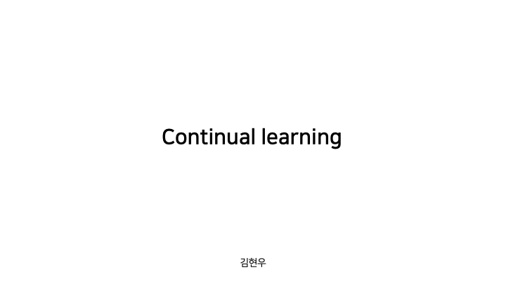
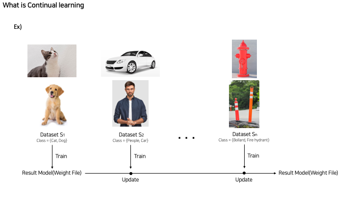
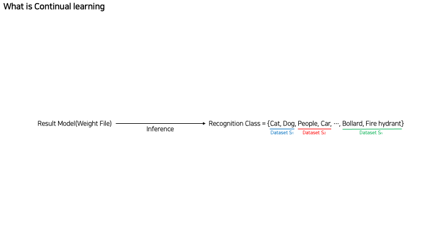
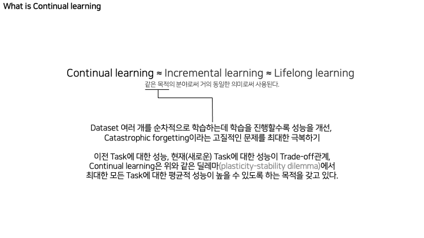
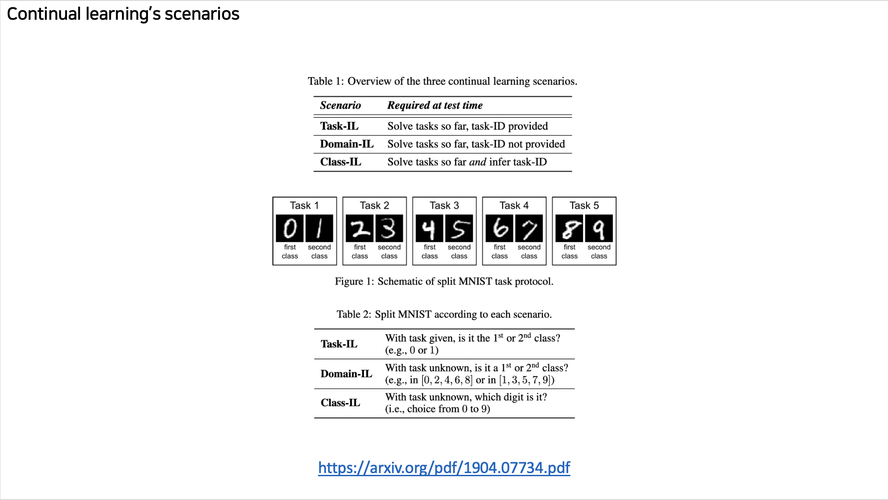

# Continual-Learning

## Outline 

### What is Continual Learning

### Continual Learning's scenarios

### Regularization based

- Elastic Weight Consolidation (EWC)
- Memory Aware Synapses (MAS)
- Variational Continual Learning (VCL)
- Adaptive Group Sparsity based Continual Learning (AGS-CL)
- Less-Forgetting-Learning (LFL)
- Learning-Without-Forgetting (Lwf)
- Learning without Memorizing (LwM)

### Memory based

- Deep Generative Replay (DGR)
- Memory Replay GANs (MeRGAN)
- Dynamic Generative Memory (DGM)
- Gradient Episodic Memory (GEM) 
- Averaged GEM (A-GEM)- Experience replay (ER)

### Parameter isolation / Dynamic structure(architecture)

- Progressive Neural Network ( PNN ) 
- Dynamically Expandable Networks (DEN)
- Compacting, Picking and Growing (CPG) (+ PackNet, Piggyback, PAE )

- Conditional Channel Gated Networks  (CCGN)
- Dynamically Expandable Representation (DER)

## What is Continual Learning

## Continual Learning's scenarios

## Elastic Weight Consolidation (EWC)

[Ewc python code](./ewc.py)       

#### Reference 
https://arxiv.org/pdf/1612.00796.pdf  
https://arxiv.org/pdf/1710.10628.pdf  
https://arxiv.org/pdf/2003.13726.pdf  
https://arxiv.org/pdf/1612.00796.pdf  
https://arxiv.org/pdf/1706.08840.pdf  
https://arxiv.org/pdf/1812.00420.pdf  
https://arxiv.org/pdf/1511.05952.pdf  
https://arxiv.org/pdf/2007.06700.pdf  
https://arxiv.org/pdf/1606.04671.pdf  
https://arxiv.org/pdf/1708.01547.pdf  
https://arxiv.org/pdf/1910.06562.pdf  
https://sjkim-icd.github.io